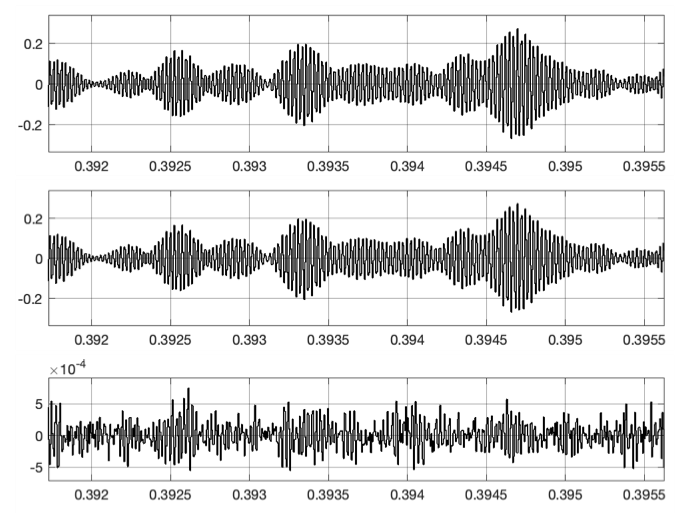
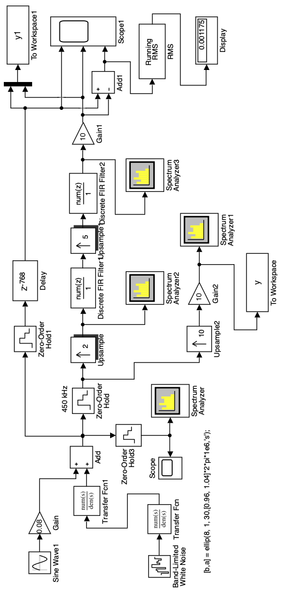
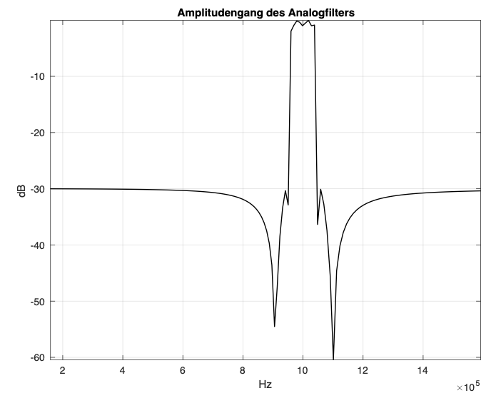
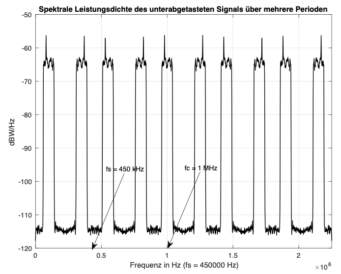
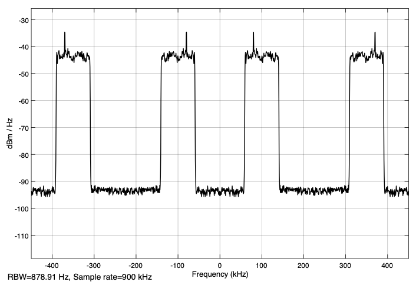

## Sampling bandpass signals

### 1.1 Introduction

It is known [1], [3] that bandpass signals can be sampled with a sampling frequency which is lower than the sampling frequency according to the sampling theorem. 

Fig. 1 shows an example of how the spectrum of a bandpass signal sampled with fs (Fig. 1a) arises in the baseband with $−f_s / 2 ≤ f <f_s / 2$ or $0 ≤ f <f_s$. The bandpass signal is assumed to have a center frequency $f_c = (f_{max} + f_{min}) / 2$ and bandwidth $\Delta f = f_{max} - f_{min}$. The sampling frequency $f_s$ is less than twice the maximum frequency $f_c + \Delta f / 2$ and therefore does not meet the requirement of the sampling theorem.

If one assumes the sampling as a multiplication of the bandpass signal with a periodic signal of delta pulses (delta functions) of the period Ts, then the spectrum of the sampled signal in the frequency domain is formed from the convolution of the spectrum of the bandpass signal with a periodic sequence of delta functions of the period $f_s = 1 / T_s$ [2]. This sequence represents the Fourier transformation of the periodic delta pulses of the period Ts from the time domain (Fig. 1 b).

Convolution with delta functions is very easy. The origin of the frequency zero of the spectrum of the bandpass signal is shifted at the points of the delta functions. The first convolution with the delta function 0 (Fig. 1c) repeats the spectrum of the bandpass signal weighted with $1 / T_s$ [2]. The weighting is omitted in the illustrations for the sake of simplicity.

Fig. 1: Formation of the spectrum of a subsampled bandpass signal

The result of the convolution with the delta function −1 is shown in Fig. 1d. Some results of further convolutions are shown in Figs. 1 e, f, g, h. If you add the spectra of all possible convolutions, you get the spectrum from Fig. 1i. This spectrum is periodic and, like all others, extends from $-\infty$ to $\infty$.

The spectrum in the baseband is now the spectrum between $f = 0$ and $f = f_s$ or between $f = −f_s / 2$ and $f = f_s / 2$. In this example, the sampling frequency was chosen so that the partial spectra do not intersect. The original bandpass signal (now time-discrete) can always be reconstructed from the corresponding signal in the baseband. 

The inclined roof shape of the original spectrum shows the possible  inversion in the baseband that can occur in the spectra of the undersampled bandpass signal.

It is now clear that the sampling frequency $f_s$ is to be selected as a function of the parameters $f_c$ and $\Delta f$ of the bandpass signal so that the spectra do not intersect (overlap). There are several solutions for $f_s$ and various diagrams are shown in the literature [1] to facilitate the selection of the sampling frequency.

The representations from Fig. 1 are correct scaled and can be used for an example. With $f_c = 40$ kHz and $\Delta f = 4$ kHz one can assume a value of 36 kHz for $2f_s$ and thus one obtains a value of 18 kHz for $f_s$. This example will be examined later using MATLAB and Simulink.

The sampling in this form with the much lower sampling frequency is cheaper in terms of efforts.

### 1.2 Undersampling of bandpass signals

The method for determining the undersampling described in [3] is used here. Fig. 2 shows the spectra for ideal subsampling of a time continuous bandpass signal of bandwidth $\Delta f$ and center frequency $f_c$.

Fig. 2: Ideal spectra of an undersampled bandpass signal

It is assumed that NZ partial spectra which do not overlap are formed by the undersampling. The number NZ in a first approximation is:

$$ NZ=\frac{f_c + \Delta f/2}{\Delta f} $$

Since $\Delta f = f_s / 2$, NZ dependent on fs becomes:

$$ NZ=\frac{4f_c + f_s}{2f_s} $$

NZ must be an integer (even or odd). After selecting NZ by rounding, a new corrected sampling frequency is determined with:

$$f_s= \frac{4f_c}{2NZ-1} $$

It must meet the condition $f_s ≥ 2\Delta f$.

An example should explain the procedure in more detail. The example uses the Illustration from Fig. 1. 

For the processing of the result after the subsampling one must have gaps in the partial spectra, especially with regard to the processing with real filters, which always have transition areas. A larger bandwidth is therefore assumed, which then also takes the spaces into account.

Specifically, a bandwidth of $\Delta f = 8$ kHz and $f_s = 16$ kHz is assumed. That is 2 kHz each to the left and right of the real bandwidth of 4 kHz. From this it follows a value for NZ of 5.5. With NZ = 5, a corrected sampling frequency is determined. This gives $f_s = 17.7777$ kHz, which can be rounded to 18 kHz. 

Similarly, if you take NZ equal to 6, you get a sampling frequency $f_s = 14.5455$ kHz and the spectrum in the baseband is inverted. For even values ​​NZ, the spectrum is always inverted in the baseband. It is important that in both cases the partial spectra do not overlap and that sufficient gaps  are created.

### 1.3 Simulation of the undersampling of a bandpass signal

The simulation is carried out with the Simulink model 'subsampling1.slx', which is initialized and called from the script 'subsampling_1.m'. The Simulink model is shown in Fig. 3.

The input source is a random signal (white noise) from the 'Band-limited White Noise' block which, with a very high (fnoise = 1e6 Hz) sampling frequency, practically generates continuous noise. Because the parameters of this block 'Noise power' and 'Sample time' were chosen to be the same, the average power is equal to 1 watt. The spectral power density of the noise signal is therefore 1 / 1e6 or 10*log10 (1e-6) = - 60 dBWatt / Hz.

With two analog filters in the blocks 'Transfer Fcn' and 'Transfer Fcn1', the bandpass signal is generated with good attenuation in the stop band. The filters are calculated with the following line in the script:

Fig. 3: Simulink model of the subsampling ('subsampling_1.m', 'subsampling1.slx'

>nord = 6;
>
>dp = 1; % Rippel in the passband in dB
>
>ds = 40; % Attenuation in the stopband in dB
>
>[b,a] = ellip(nord, 1, ds,[fmin, fmax]\*2\*pi,’s’); % Elliptic filter

The bandwidth is limited to 4 kHz by fmax = 42 kHz and fmin = 38 kHz. The center frequency is fc = 40 kHz. In order to determine the possible inversion of the spectrum in the frequency range, a sinusoidal signal with a frequency of 39 kHz near the fmin frequency is added.

The time-continuous signal at the output of the 'Add' block is sampled with a sampling frequency of 10fs in the 'Zero-Order Hold1' block in order to display its power spectral density with the 'Spectrum Analyzer1' block.

Fig. 4 shows the power spectral density that is displayed on this block. You can see the noise signal with a spectral power density of -60 dB Watt / Hz and the spectral power density of the sinusoidal signal with a frequency of 39 kHz. The sampling frequency of fs * 10 for displaying the spectrum of the input signal is chosen so that the spectrum of the bandpass signal with a center frequency of 40 kHz can be seen. The frequency fs = 18 kHz is calculated as shown above for NZ = 5.

Fig. 4: Power spectral density of the input signal ('subsampling_1.m', 'subsampling1.slx')

The subsampling is implemented with the 'Zero-Order Hold' block. Different sampling frequencies fs can be selected in the script:

>fs = 18e3;          % NZ = 5;
>
>%fs = 15e3;          % NZ = 6;
>
>%fs = 14.5455e3;      % NZ = 6;
>
>%fs = 17.777e3;      % NZ = 5;

The power spectral density after subsampling with fs = 14.5455 kHz is shown with the block 'Spectrum Analyzer' and is deplayed in Fig. 5. The power spectral density is retained and the spectrum appears inverted in the frequency range between 0 and fs / 2 = 14.55 / 2 = 7.27 kHz. 

With a sampling frequency derived from an odd number NZ, such as 18 kHz, the power spectral density which is shown in Fig. 6 is obtained. Now the spectrum is not inverted in the baseband.

Fig. 5: Power spectral density after subsample with fs = 14.5455 kHz ('subsampling_1.m', 'subsampling1.slx')

Fig. 6: Power spectral density after subsample with fs = 18 kHz ('subsampling_1.m', 'subsampling1.slx')

In order to display the partial spectra up to the center frequency of 40 kHz, the sampling frequency is increased to fs * 10 with the block 'Upsample'. Nine zero values are placed between the samples of the undersampled signal. After amplification by a factor of 10, the signal y is obtained. A section of this signal is shown in Fig. 7.

Fig. 7: The subsampled signal after the 'Upsample' block (excerpt) ('subsampling_1.m', 'subsampling1.slx')

The power spectral density of this signal is shown in Fig. 8. It is shown with the 'Spectrum Analyzer2' block and calculated in the script with the following line

>[Pyy, F] = pwelch (ys, hann (4096), [256], 4096, fs * 10);

and then desplayed. The representation corresponds to a section of Fig. 1i.
The partial spectra that are shown also contain the spectrum of the original signal with a center frequency fc = 40 kHz. This allows the original bandpass signal (now digital) to be reconstructed from this upsampled signal.

Fig. 8: Power spectral density of the subsampled signal shown over several periods ('subsampling_1.m', 'subsampling1.slx')

### '1.4 Reconstruction of the bandpass signal from its undersampling

The reconstruction of the bandpass signal from the undersampled signal of the previous example is examined with the Simulink model 'subsampling2.slx' and the script 'subsampling_2.m'. The model is shown in Fig. 9.

Fig. 9: Simulink model of the reconstruction of the bandpass signal from the subsampled signal ('subsampling_2.m', 'subsampling2.slx')

It is based on the model from Fig. 3 of the previous simulation. From the signal after the upsample and amplification, a digital FIR filter is used to extract the bandpass range at the frequency of 40 kHz (see Fig.
8). The coefficients of the filter are directly in the block implemented:

>fir1 (256, [36, 44] * 2e3 / 
>(fs * 10)

The power spectral density after the FIR filter is displayed with the Block 'Spectrum Analyzer' and is shown in Fig. 10.

Fig. 10: Power spectral density of the signal after the FIR filter ('subsampling_2.m','subsampling2.slx')

One can still see the remains of the suppressed partial spectra because of the non ideal filter. The partial spectra are suppressed by approx. 60 dBW / Hz (from -60 to -120 dBW / Hz). The input bandpass signal after the 'Add' block is sampled with the 'Zero-Order Hold2' block with a frequency fs * 10 and now forms the digital bandpass signal with which the reconstructed signal of the same sampling frequency is compared. For this, it is delayed in the block delay with the delay resulting from the FIR filter.

Fig. 11: Input bandpass signal, reconstructed bandpass signal and their difference ('subsampling_2.m','subsampling2.slx')

With the 'Add1' block and 'RMS' block, which is parameterized with 'Running mean', the standard deviation of the difference is displayed (here 0.0002634), which is relatively small. The input bandpass signal, the reconstructed bandpass signal and the difference are displayed on the 'Scope' block, as shown in the excerpt from Fig. 11.

### 1.5 Reconstruction of the bandpass signal in several stages

If there is a big difference between the center frequency $f_c$ and the bandwidth $\Delta f$, then the partial spectra are very close together after the upsampling and one cannot develop a filter that can extract the spectrum of the desired bandpass signal.

As an example of such a possibility, a reconstruction in two stages for a bandpass signal with a center frequency of 1 MHz and a bandwidth of 100 kHz is described. Fig. 12 shows the Simulink model 'subsampling3.slx', which is initialized and called from the script 'subsampling_3.m'.

Fig. 12: Simulink model of the reconstruction of a bandpass signal in two stages ('subsampling_3.m', 'subsampling3.slx')

The input signal is formed as in the previous example. The two analog filters are developed in the script with the following instruction:

>[b, a] = ellip (8,1,30, [0.96, 1.04] * 2 * pi * 1e6, ’s’);

You can see the desired pass band of the analog bandpass filter from 0.96 MHz to 1.04 MHz and the relatively small attenuation of the stop band of 30 dB. This is the only way to get steep flanks of the amplitude response, which is shown in Fig. 13.

Fig. 13: Amplitude response of the two analog filters ('subsampling_3.m','subsampling3.slx')

The power spectral density of the subsampled signal over several periods is shown in Fig. 14. It is formed with the blocks 'Upsample2' and 'Gain2' and displayed on the 'Spectrum Analyzer1'. This power spectral density is calculated in the script with the following program line:

>[Pyy, F] = pwelch (ys, hann (4096), [256], 4096, fs * 10);

The function pwelch is used, which implements the Welch method [2].

Fig. 14: Power spectral density of the undersampled signal over several periods ('subsampling_3.m','subsampling3.slx')

The representation of this spectral power density in Fig. 14 shows that the spectrum is not inverted in the range from 0 to fs / 2 = 225 kHz (NZ = 5) and that the spectrum of the desired bandpass signal is available at a frequency of 1 MHz. Ones just have to extract it with a bandpass filter, now digitally.
Upsampling by a factor of 10 is implemented in two stages. So you get larger spaces between the partial spectra and the digital bandpass filters are simpler.

The factor 10 is broken down into two factors 2 and 5. With the 'Upsample' block, upsampling with a factor of 2 is first implemented. The power spectral density after this upsampling is shown in Fig. 15.

Fig. 15: Power spectral density after upsampling with a factor of 2 ('subsampling_3.m','subsampling3.slx')

One of the two partial spectra in the range 0 to 2fs / 2 = 450 Hz is suppressed with the FIR filter from the block 'Discrete FIR Filter' and the remaining one is then responsible by upsampling to form the partial spectra in which the desired bandpass spectrum is available. 

The only question that arises is which part of the spectrum has to be suppressed. The solution here is relatively easy to find through trials, because only two partial spectra are available. Here you have to suppress the partial spectrum between approx. 300 kHz and 400 kHz and thus the coefficients of the FIR filter are calculated with

>fir1 (256, [0.05,0.15] * 2 / 0.9)

for a passband between 50 kHz and 150 kHz.

After the second upsampling with a factor of 5, the partial spectra that also contain the desired bandpass range are extracted with the second FIR filter from block 'Discrete FIR Filter1'. To view these partial spectra you only have to connect the 'Spectrum Analyzer3' in front of the filter. The filter is direct in the block with

>fir1 (256, [0.91,1.09] * 2 / 4.5)

initialized. It extracts the frequency range of the original input signal between 0.91 MHz and 1.09 MHz, the range slightly larger than the bandwidth of the analog filters.

At the 'Scope1' block, the digitized delayeded input signal with the delays due to the filters, the reconstructed signal and their difference are displayed. The standard deviation of the difference is shown on the block 'Display' and one can see that it is relatively small.

The reader is advised to sample the same bandpass signal with a frequency of 360 kHz and then to reconstruct it via upsampling in two stages with factors of 2 and 6. After viewing the power spectral densities after downsampling and after the upscanning with factor 12 (2 x 6), you can select the filters passband and parameterize the filter.

A solution is shown with the model 'subsampling4.slx'. The model is parameterized directly, without a script. Before starting it, one must develop the coefficients b, a of the analog filter in MATLAB with the help of the instruction given in the model. 

The first partial spectrum in the baseband is now inverted (NZ = 6) and the FIR filter of the first stage has to extract the second partial spectrum between 180 kHz and 350 kHz, which is not inverted, so that after the second up-sampling the bandpass signal at 1 MHz is correctly present.

### REFERENCES

[1] Richard G. Lyons, “Understanding Digital Signal Processing” 3 Edition, Prentice Hall 2010

[2] Proakis, John G. and Manolakis, Dimitris G.: Digital Signal Proces- sing. Principles, Algorithms and Applications. Prentice Hall, 2006.

[3] Walt Kester: The Data Conversion Handbook. Analog Devices Inc., 2004.

